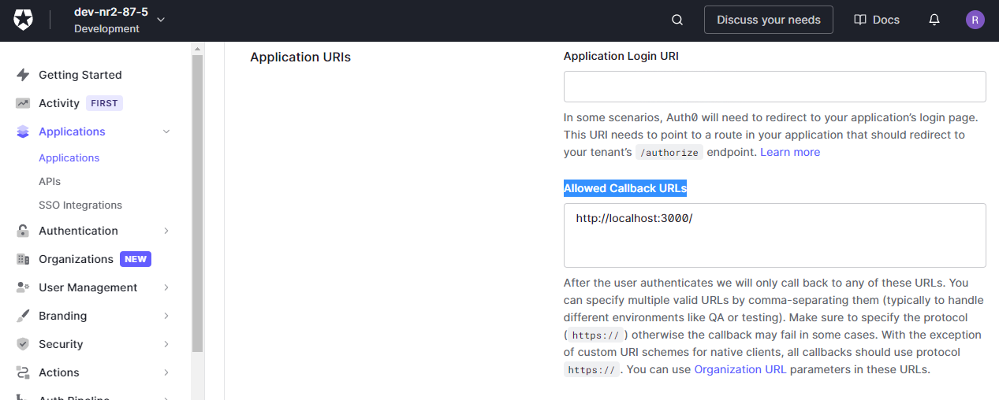

# AUTH0 AND CIRCLE
# Getting Started


In this article, you will learn how to include Auth0 login features in Circle Service. It is a single application page that uses Node.js/Express as the backend and HTML and JS as the frontend. Circle Service handles the entire authentication process and securely stores the access token.


The application will:

- Check if the Circle Service is running and connect to it.
- Check if an Auth0 Access Token is stored in the Circle Service and perform the login process, or redirect the user at the first login and store the Access Token securely.
- Display user authenticated information (via JWT)


To develop the application, we need to follow some steps:


## 1. Create a Circle Service Account

 Before you start developing for Circle Service, you need to create your Circle account. You can register by clicking <a href="https://gocircle.ai/get-the-circle-api">here</a>. After registering, you will receive an email with this information:

  - CustomerCode
  - AuthCode
  - AppKey
  - PrivateKey
  - PublicKey
  - Secret

We will use this information to initialize the Circle and call the API methods.

Please, check out the <a href="https://internal.gocircle.ai/api/getstarted/">Circle Service getting started</a>. There is a step-by-step guide on how to download, install, and test the Circle Service.

## 2. Create an Auth0 Client Application

At this point, you need an Auth0 account. You can sign up <a href="https://auth0.com/pt/signup">here</a>. 

After logging in, go to the Auth0 Dashboard, select "Applications- > Applications" from the left menu, and click the "Create Application" button. Give the application a name and make sure you select Single Page Web Applications before clicking the "Create" button (you can also change the type later).

Under the "Settings" option, you will find the information we need to set up our test application, domain, and client ID. Make a note of this information; we will use it in the next steps.

### Configure the callback, logout, and Web Origin URLs

Make sure you enter the URL and port in the Allowed callback URLs field. In our test application, we use port 3000, as shown in Figure 1.


Figure 1

## 3. Creating the test application

First, we need a backend to generate the Circle token. This sample application uses a simple
Node.js/Express backend for token generation.

Note that this sample application is intended to illustrate the Circle security elements in a simple and condensed way. Therefore, many features that are necessary for production, such as error handling and configuration files, have been omitted.


To setup the Express app, start by typing <code>npm init</code> from the command line. Next, in the same direcotry where
you ran init, install Express running <code>npm install express</code>

### Basic server.js file

```
  const express = require('express');
  const path = require('path');
  const app = express();

  // express.static serves the client of /public/index.html. This file contains all the
  // HTML code and JS, so everything is easier to understand.

  app.use(express.static(path.join(__dirname, "public")));

  app.listen(3000);
  console.log('Listening on http://localhost:3000');

```

We need to add an endpoint to our server that will generate and return Circle's token, which will be used by our client to make Circle API calls.
For this purpose, we create a file called token-gen.js.
In this file, we add the following code:


```
const dotenv = require('dotenv');
const axios = require('axios');
const crypto = require("crypto");
dotenv.config();


var encryptData = function(dataToEncrypt) {
    return crypto.createHmac('sha256', process.env.SECRET.trim()).update(dataToEncrypt).digest('base64');
}

/**
 *  Generate the token using Circle's credentials
 * 
 * @returns {String} 
 */

async function circleToken() {
    let timeStamp = Math.floor(Date.now() / 1000);
    let urlParameters = `customerId=${process.env.CUSTOMER_ID}&appKey=${process.env.APPKEY}&endUserId=${process.env.USER_ID}`;
    urlParameters += '&nonce=' + timeStamp;

    let signature = encryptData(urlParameters);

    config = {
        baseURL: process.env.API_URL,
        headers: 'Content-Type: application/json',
        data: urlParameters + '&signature=' + signature
    }
    try {
        const ret = await axios.get("https://api.gocircle.ai/api/token?" + urlParameters + '&signature=' + signature);
        const cleaned = JSON.parse(ret.data.toString().replace(/\r\n/g, ""));
        return cleaned;

    } catch (error) {
        console.log(error);
        return null;
    }

}

module.exports = circleToken;

```

This module uses some additional NPM packages that need to be installed with the command:
<code>npm install dotenv axios crypto</code>


Token generation uses the keys you received via email when you registered with Circle. To store these credentials, we create a file called <code>.env</code>. In this file, we add the following content.

```
APPKEY = 'your_circle_appkey'
CUSTOMER_ID = 'your_circle_customer_id'
USER_ID='your_circle_user_id'
PRIVATE_KEY= 'youer_circle_private_key'
API_URL = 'https://api.gocircle.ai/api/token'  
SECRET= 'your_secret'
  
```

Now we add the endpoint to the server.js file. Below you can see the server.js file with the endpoint for token generation.

```
  const express = require('express');
  const path = require('path');
  const circleToken = require('./token-gen.js');
  const app = express();

  app.get('/circle-token', async function(req, res) {
      const token = await circleToken();
      res.json({
          Token: token
      });

  });

  //express.static serves the client of /public/index.html. This file contains all the
  //HTML code and JS, so everything is easier to understand.

  app.use(express.static(path.join(__dirname, "public")));

  app.listen(3000);
  console.log('Listening on http://localhost:3000');

```
 

Next, create the file /public/index.html with the above content

```
<!DOCTYPE html>
<html>

<head>

    <script src="https://internal.gocircle.ai/api/demo/lib/jquery/3.5.1/jquery.min.js"></script>
    <script src="https://internal.gocircle.ai/api/demo/lib/bootstrap/bootstrap.bundle.min.js"></script>
    <script>
        var timestamp = new Date().getTime();
        document.write(`\x3Cscript src="https://internal.gocircle.ai/api/gocircle.ai-bundle.js?t=${timestamp}">\x3C/script>`);
        document.write(`\x3Cscript src="https://internal.gocircle.ai/api/gocircle.ai.js?t=${timestamp}">\x3C/script>`);
    </script>

    <script src="js/util.js"></script>
    <script src="js/const.js"></script>
    <script src="js/app.js"></script>
    <link rel="stylesheet" href="css/main.css">

    <link rel="stylesheet" href="https://internal.gocircle.ai/api/demo/lib/bootstrap/bootstrap.min.css">


</head>

<body>

    <div id="title" class="title">
        <h2>You are logged in as</h2>
    </div>
    <center>
        <div class="card" style="width: 18rem;">
            <div class="profile">
                
                <div class="card-body">
                    <h1 id="user"></h1>
                    <p id="email"></p>
                </div>
            </div>
            <div class="card-footer">
                <button class="btn btn-primary" id="login" style="width:100%"></i>Login</button>
                <button class="btn btn-danger" id="logout" style="margin-right: 20px;">Logout</button>
                <button class="btn btn-warning" id="reauth">Reauthenticate</button>
            </div>


        </div>
    </center>


    <div class="modal fade" id="notRunningModal" tabindex="-1" aria-labelledby="notRunningModalLabel"
        aria-hidden="true">
        <div class="modal-dialog">
            <div class="modal-content">
                <div class="modal-header">
                    <h5 class="modal-title" id="notRunningModalLabel">Circle is not running</h5>
                    <button type="button" class="btn-close" data-bs-dismiss="modal" aria-label="Close"></button>
                </div>
                <div class="modal-body">
                    <form>
                        <div class="mb-3">
                            <h5>Please download Circle Service to enable secure token storage</h5>
                        </div>
                    </form>
                </div>
                <div class="modal-footer">
                    <button type="button" class="btn btn-secondary" data-bs-dismiss="modal">Close</button>
                </div>
            </div>
        </div>
    </div>


    <div class="modal fade" id="loadingModal" tabindex="-1" aria-labelledby="loadingModal" aria-hidden="true">
        <div class="modal-dialog modal-sm">
            <div class="modal-content">
                <div class="modal-header">
                    <h5 class="modal-title">Loading...</h5>
                    <button type="button" class="btn-close" data-bs-dismiss="modal" aria-label="Close"></button>
                </div>
                <div class="modal-body d-flex justify-content-center">
                    
                </div>
            </div>
        </div>
    </div>
    <div class="modal fade" id="enterCodesModal" tabindex="-1" aria-labelledby="enterCodesModalLabel"
        aria-hidden="true">
        <div class="modal-dialog">
            <div class="modal-content">
                <div class="modal-header">
                    <h5 class="modal-title" id="enterCodesModalLabel">User is Locked</h5>
                    <button type="button" class="btn-close" data-bs-dismiss="modal" aria-label="Close"></button>
                </div>
                <div class="modal-body">
                    <h4>Enter the 2 codes</h5>
                        <form>
                            <div class="mb-3">
                                <label for="code1" class="form-label">Code 1</label>
                                <input type="email" class="form-control" id="code1">
                                <div class="form-text"></div>
                            </div>
                            <div class="mb-3">
                                <label for="code2" class="form-label">Code 2</label>
                                <input type="email" class="form-control" id="code2">
                            </div>
                        </form>
                </div>
                <div class="modal-footer">
                    <button type="button" class="btn btn-warning"
                        id="resend">Resend</button>&nbsp;&nbsp;&nbsp;&nbsp;&nbsp;&nbsp;<button type="button"
                        class="btn btn-primary" id="unlock">Check</button>
                </div>
            </div>
        </div>
    </div>

</body>

<script>

    // Please take a look at the file /public/js/const.js. 
    // It contains the configuration constants
 

    window.onload = async () => {

        // show the loading
        showHideLoader(true);

        // Check if the user is locked
        const statusJson = await checkUserIsLocked();

        if (statusJson.running === false) {
            showHideLoader(false);
            setTitle("Unable to connect to the Circle service. <br>Please check if the service is running.");
            $("#login").hide();
            return;
        }

        if (statusJson.locked === true) {
            // Displays the screen where the user can enter the 2 unlock codes.
            hideProfileAndEnterTwoCodes();
            return;
        }

        // Check if the token "auth0-demo" is stored in the circle "auth0-demo" and
        // log in to the service.

        let token = await getCircleSavedToken("auth0-demo", "auth0-token");

        hideButtons();

        if (token) {
            const tokenData = parseJwt(token);
            // show profile
            displayProfile(tokenData);
        } else {
            $(".card").show();
            $("#login").show();
            showHideLoader(false);
        }
    }

    $("#login").on("click", function () {
        showHideLoader(true);
        tryToLogin();
    });

    $("#logout").on("click", function () {
        showHideLoader(true);
        reset();
    });

    $("#reauth").on("click", function () {
        hideProfileAndLock();
    });

    $("#resend").on("click", function () {
        hideProfileAndLock();
    });


    showCard(false);
    $(".card").hide();
    hideButtons();
    setTitle("");


</script>

</html>

```

To make the code cleaner, we create the /public/js/app.js file that will contain the helper functions for the API calls.
We also create the util.js file with helper functions. The final code from the project is available here.

The authentication process with the Circle Service is very simple. In the following, we will detail each of the necessary API calls.

Let´s start the login flow:


The first step is to check if the user is locked out. This is done by calling the <code>checkUserIsLocked</code> function.

```

<script>
 
    //Check if the user is locked
    const statusJson = await checkUserIsLocked();

    if (statusJson.running === false) {
        showHideLoader(false);
        setTitle("Unable to connect to the Circle service. <br>Please check if the service is running.");
        $("#login").hide();
        return;
    }

    if (statusJson.locked === true) {
        //displays the screen where the user can enter the 2 unlock codes.
        hideProfileAnterTwoCodes();
        return;
    }

 </script>   

```

The function <code>checkUserIsLocked</code> is defined in the file /public/js/app.js and contains the following code:

```
 async function checkUserIsLocked() {

    if (!isCoreRunning) {
        await connectToCircle();
        if (!isCoreRunning) {
            return { "running": false,"locked": false };
        }
    }

    const circleTopicData = await getCircleAndTopic();
    if (!circleTopicData) {
        return false;
    }

    const userData = await Circle.whoAmI(circleTopicData.CircleId);
    if (userData) {
        if (!userData.Locked) {
            tryToLogin();
        }
        return { "running": true, "locked": userData.Locked };
    }

}

``` 
Once the Circle service is running and connected, next use the <code>getCircleSavedToken</code> function, which checks to see if a token named "auth0-demo" exists in Circle, and log in to the service.


```
<script>

    // Please take a look at the file /public/js/const.js. 
    // It contains the configuration constants
    
   window.onload = async () => {

        // show the loading
        showHideLoader(true);

        // Check if the user is locked
        const statusJson = await checkUserIsLocked();

        if (statusJson.running === false) {
            showHideLoader(false);
            setTitle("Unable to connect to the Circle service. <br>Please check if the service is running.");
            $("#login").hide();
            return;
        }

        if (statusJson.locked === true) {
            // Displays the screen where the user can enter the 2 unlock codes.
            hideProfileAndEnterTwoCodes();
            return;
        }

        // Check if the token "auth0-demo" is stored in the circle "auth0-demo"
        // and log in to the service.

        let token = await getCircleSavedToken("auth0-demo", "auth0-token");

        hideButtons();

        if (token) {
            const tokenData = parseJwt(token);
            // show profile
            displayProfile(tokenData);
        } else {
            $(".card").show();
            $("#login").show();
            showHideLoader(false);
        }
    }

</script>
 
```

The <code>getCircleSavedToken</code> function is defined in the /public/js/app.js file and contains the following code:


```

/**
 * checks whether a token with the name from the parameter tokenId *
 * exists in a circle named with the parameter tokenCircle and returns the 
 * corresponding token.
 * 
 * @param {String} tokenCircle 
 * @param {String} tokenId 
 * @returns String with the stored token 
 */
async function getCircleSavedToken(tokenCircle, tokenId) {
    const circleTopicData = await getCircleAndTopic();
    if (!circleTopicData) {
        return null;
    }

    const loginToService = await Circle.logintoService(circleTopicData.CircleId, 0, tokenCircle, tokenId);

    if (!loginToService || !loginToService.Status.Result || !loginToService.ServiceReturn) {
        return null;
    }

    return loginToService.ServiceReturn;
}

```
 

If no token is stored in Circle, the user must be redirected to Auth0 authentication. After logging in, Auth0 redirects the user to the callback page. At this point, the authorization code is exchanged for a token and the token is stored in the Circle service.

The function <code>firstLogin</code> redirects the user to the Auth0 login page. Above the firstLogin content:


```
 
/**
 * This function checks if the Circle service is running and connected.
 * It then creates the service configuration JSON, which is stored in
 * Circle. At the end of the function, the user is redirected to the
 * login page
 * 
 */
async function firstLogin() {

    if (!isCoreRunning) {
        showNotConnected();
        console.log("Not connected to Circle Service");
        return isCoreRunning;
    }
    // Get a cryptographically secure random string of variable length. 
    const state = randomString(32);
    const codeVerifier = randomString(64);

    // Get the sha256 digst of codeVerifier
    const codeChallenge = await sha256(codeVerifier).then(bufferToBase64UrlEncoded);

    // we need to store the state to validate the callback
    // and also the code verifier to send later
    sessionStorage.setItem(`login-code-verifier-${state}`, codeVerifier);
    const circleTopicData = await getCircleAndTopic();
    if (!circleTopicData) {
        return null;
    }

    // Object that stores the Auth0 configuration
    // for Circle Service login
    const serviceConfigurationJson = {
        "domain": AUTH0_DOMAIN,
        "client_id": AUTH0_CLIENT_ID,
        "code_challenge": codeChallenge,
        "code_challenge_method": "S256",
        "scope": "openid profile email offline_access",
        "state": state,
        "response_type": "code"
    }

    const configService = await Circle.configureService(circleTopicData.CircleId, 0, tokenCircle,
        JSON.stringify(serviceConfigurationJson));

    // Fetch the openid configuration for the issuer.
    // Look inside util.js
    const config = await getConfig();
    const authorizationEndpointUrl = new URL(config.authorization_endpoint);

    authorizationEndpointUrl.search = new URLSearchParams({
        redirect_uri: AUTH0_REDIRECT_URI,
        client_id: AUTH0_CLIENT_ID,
        response_type: 'code',
        scope: 'openid profile email offline_access',
        code_challenge: codeChallenge,
        code_challenge_method: 'S256',
        state: state
    });

    window.location.assign(authorizationEndpointUrl);
}

```
For this example, we set the same page as the callback URL in the Auth0 application.
We need to add a function that processes the Auth0 callback. Above you can see the source code of the function:
 
```
 /**
 * The function checks the URL for code and state parameters, exchanges the
 * authorization code for a token, stores the token in Circle, and displays 
 * the user information using the token
 * 
 */
(async function handleCallback() {

    const search = new URLSearchParams(window.location.search);

    if (!search.has('code')) { return; }

    $(".card").hide();
    $("#login").hide();

    hideButtons();
    setTitle("");

    const code = search.get('code');
    const state = search.get('state');
    const code_verifier = sessionStorage.getItem(`login-code-verifier-${state}`);

    if (!code_verifier) {
        console.error('unexpected state parameter');
        return;
    }

    const config = await getConfig();

    // exchange the authorization code for a tokenset
    const tokenSet = await fetch(config.token_endpoint, {
        method: 'POST',
        body: new URLSearchParams({
            // audience: API_AUDIENCE,
            client_id: AUTH0_CLIENT_ID,
            redirect_uri: AUTH0_REDIRECT_URI,
            grant_type: 'authorization_code',
            code_verifier,
            code,
        }),
        headers: new Headers({
            'Content-type': 'application/x-www-form-urlencoded; charset=UTF-8'
        })
    }).then(returnJson => returnJson.json());


    if (!isCoreRunning) {
        const isConneted = await connectToCircle();
    }

    // save the token in Circle Service    
    const isSaved = await saveTokenToCircle("auth0-token", tokenSet.refresh_token);

    // Parse the token to display user information.
    const tokenData = parseJwt(tokenSet.id_token);
    displayProfile(tokenData);
    $(".card").show();

    window.tokenSet = tokenSet;
    window.verifier = code_verifier;

    // remove the querystring from the url in the address bar
    removeHistory();
})();


```

The <code>reAuthenticate</code> method locks the user and generates the unlock codes that need to be decrypted using the primary key (that you got upon registration) and sent to the user, e.g. via SMS and email.

Source code of the function:

```
/**
 * 
 * Locks the user and displays the screen for the user
 * enter the 2 codes.
 * 
 */

async function reAuthenticate() {
    if (!isCoreRunning) {
        await connectToCircle();
        if (!isCoreRunning) {
            return;
        }
    }

    const circleTopicData = await getCircleAndTopic();
    if (!circleTopicData) {
        return false;
    }

    //The number 2 means the number of codes to generate.
    const codes = await Circle.lockUser(circleTopicData.CircleId, 2);

    if (codes && codes.Status.Result && codes.EncryptedUnlockCodes.length > 1) {
        const code1 = codes.EncryptedUnlockCodes[0];
        const code2 = codes.EncryptedUnlockCodes[1];

        //The codes must be decrypted with the primary key (we recommend doing that in the backend) 
        // and sent to the user, for example by e-mail and SMS
        console.log("Unlock code 1: " + code1);
        console.log("Unlock code 2: " + code2);

    }
    //displays the screen for entering the activation codes
    showEnterTwoCodes();
}

```


